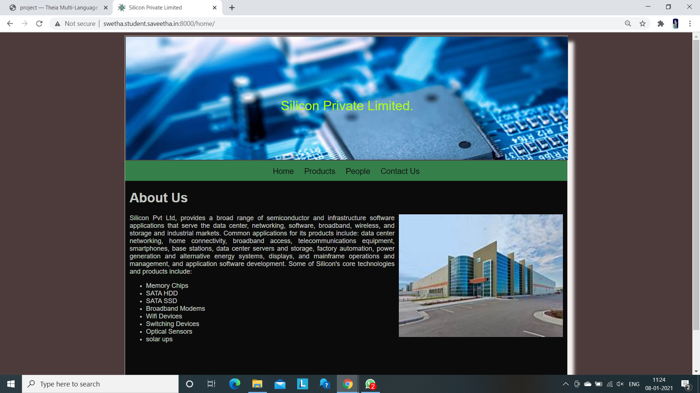
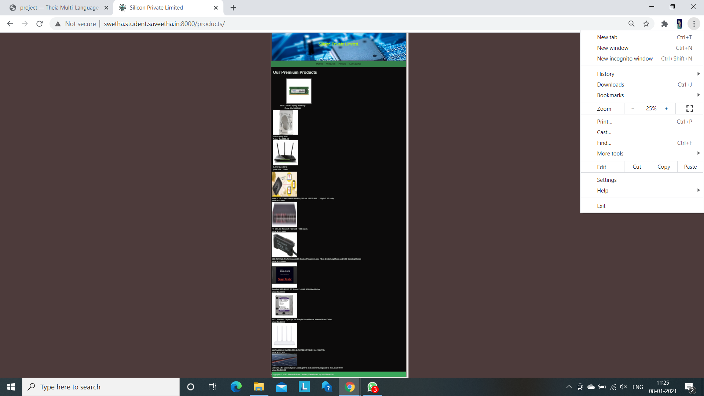
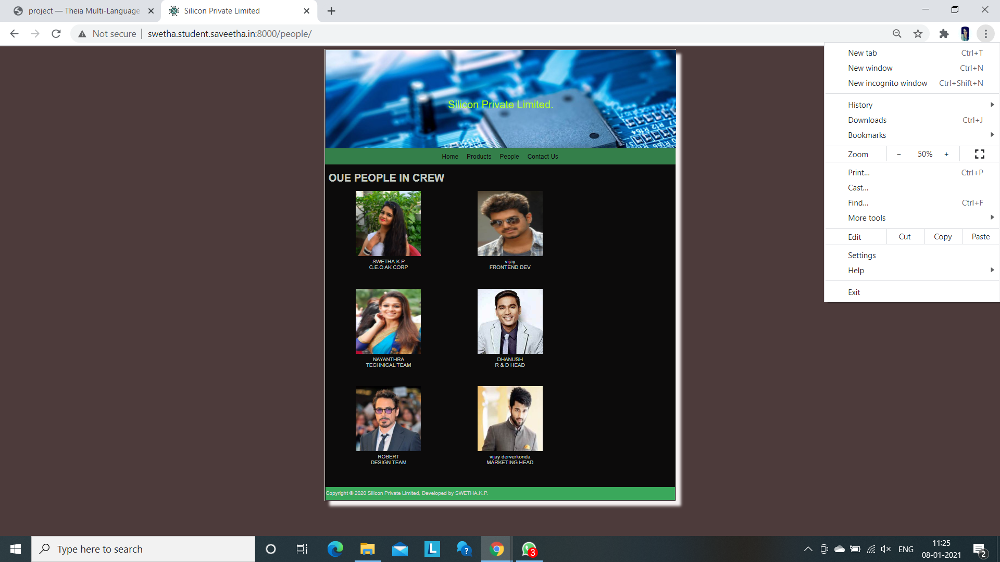
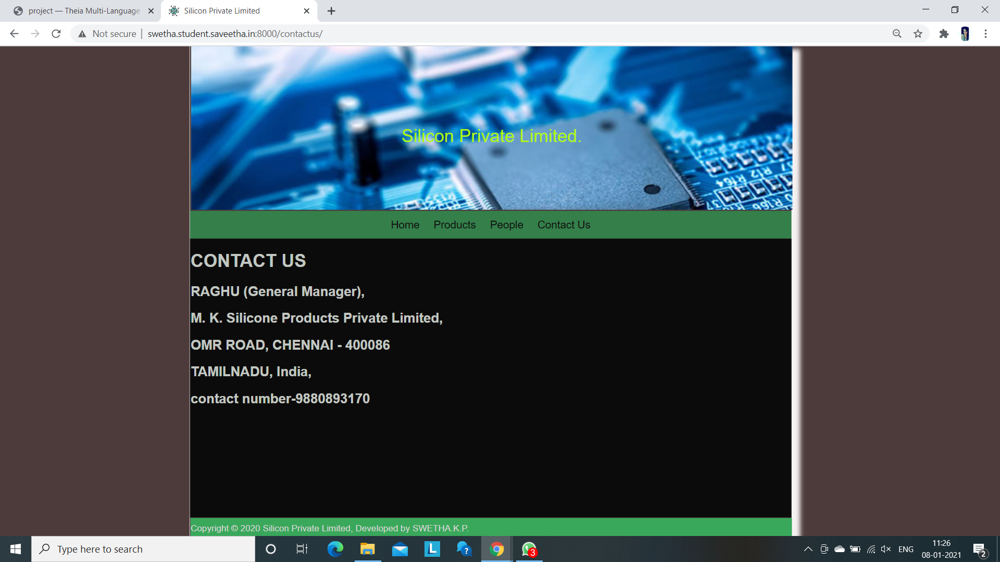
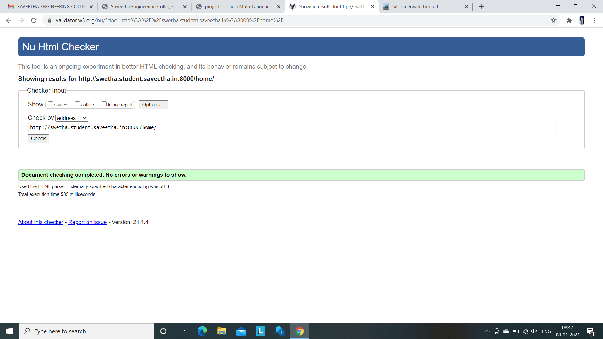
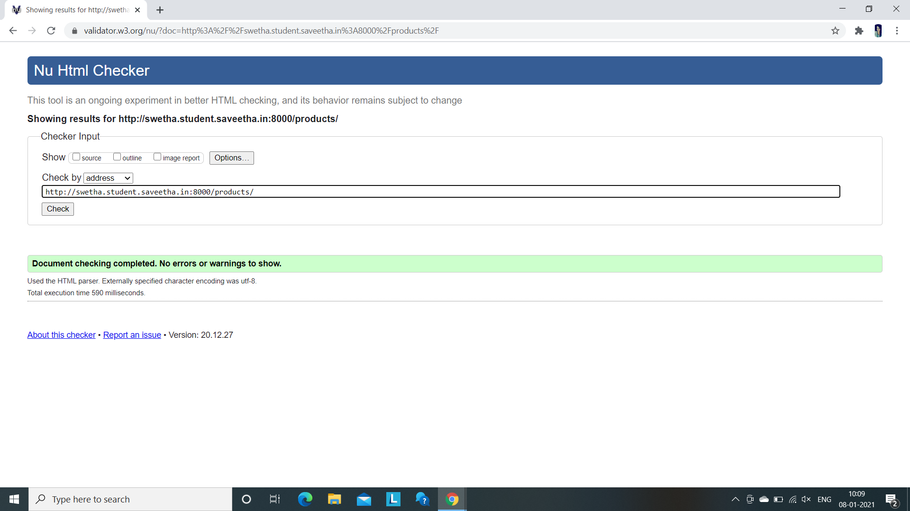
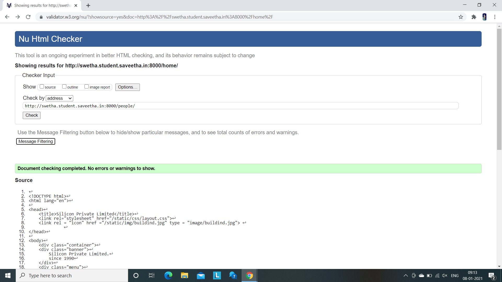

# Web Design for a Manufacturing Company
## AIM: 
To design a static website for a chip manufacturing company.

## DESIGN STEPS:
### Step 1: 
Requirement collection.
### Step 2:
Creating the layout using HTML and CSS.
### Step 3:
Updating the sample content.
### Step 4:
Choose the appropriate style and color scheme.
### Step 5:
Validate the layout in various browsers.
### Step 6:
Validate the HTML code.
### Step 6:
Publish the website in the given URL.

## PROGRAM:

### base.html

```

<!DOCTYPE html>
<html lang="en">

<head>
    <title>Silicon Private Limited</title>
    <link rel="stylesheet" href="">
    <link rel = "icon" href ="" type = "image/x-icon"> 
              
</head>

<body>
    <div class="container">
    <div class="banner">
        Silicon Private Limited.
    </div>
    <div class="menu">
        <div class="menuitem"><a href="/home">Home</a></div> 
        <div class="menuitem"><a href="/products">Products</a></div> 
        <div class="menuitem"><a href="/people">People</a></div>
        <div class="menuitem"><a href="/contactus">Contact Us</a></div> 
    </div><div class="content">
        
    
    </div>
    <div class="footer">
        Copyright © 2020 Silicon Private Limited, Developed by SWETHA.K.P.
    </div>
    </div>
</body>

</html>
```
### home.html
```



    <div class="homecontent">    
    <h1>About Us</h1>
    
    <div class="contenttext">
    Silicon Pvt Ltd, provides a broad range of semiconductor and infrastructure software applications that serve the data center, networking, software, broadband, wireless, and storage and industrial markets. Common applications for its products include: data center networking, home connectivity, broadband access, telecommunications equipment, smartphones, base stations, data center servers and storage, factory automation, power generation and alternative energy systems, displays, and mainframe operations and management, and application software development. Some of Silicon's core technologies and products include:
    <ul>
        <li>Memory Chips</li>
        <li>SATA HDD</li>
        <li>SATA SSD </li>
        <li>Broadband Modems</li>
        <li>Wifi Devices</li>
        <li>Switching Devices</li>
        <li>Optical Sensors</li>
        <li>solar ups</li>
    </ul> 
    </div>
    </div>

```
### products.html
```



<div class="productcontent">
    <h1>Our Premium Products</h1>
    <div class="productitems">
        <div class="productitem">
            <div class="itemimage">
                 
            </div>
            <div class="itemname">4GB DDRA4 laptop memory</div>
            <div class="itemprice">Price: Rs.2000.00 </div>
        </div>
        <div class="productitem"></div>
        <div class="itemimage">
            
        </div>
        <div class="itemname">1TB Laptop HDD</div>
        <div class="itemprice">Price: Rs.5000.00 </div>
        <div class="productitems">
            <div class="itemimage">
                

            </div>
            <div class="itemname">2.4 GHz, 5 GHz</div>
        </div>
        <div class="itemprice">price: Rs.1,5000</div>
    </div>
</div>
<div class="productitems">
    <div class="itemimage">
        
    </div>
    <div class="itemname">WAN: LTE (2300/1800/850MHz), WLAN: IEEE 802.11 b/g/n 2.4G only</div>
    <div class="itemprice">price: Rs.2000</div>
</div>
<div class="productitems">
    <div class="itemimage">
        
    </div>
    <div class="itemname">FF-SFL-03 Network Firewall - 100 users</div>
    <div class="itemprice">price: Rs.21000</div>
    <div class="productitems">
        <div class="itemimage">
            </div>
        <div class="itemname"> E3X-NA High PerformanceE3X Series Programmable Fibre Optic Amplifiers and E32 Sensing
            Heads</div>
        <div class="itemprice">price: Rs.14000</div>
        <div class="productitems">
            <div class="itemimage">
                
            </div>
            <div class="itemname">Sandisk SSD PLUS 63.5 mm 120 GB SSD Hard Drive</div>
            <div class="itemprice">price: Rs.7000</div>
            <div class="productitems">
                <div class="itemimage">
                    
                </div>
                <div class="itemname">WD ( Western Digital ) 4 TB Purple Surveillance Internal Hard Drive</div>
                <div class="itemprice">price: Rs.8000</div>
                <div class="productitems">
                    <div class="itemimage">
                        </div>
                    <div class="itemname">XIAOMI MI 4C WIRELESS ROUTER (DVB4211IN, WHITE)</div>
                    <div class="itemprice">price: Rs.1,400</div>
                </div>
                <div class="productitems">
                    <div class="itemimage">
                        
                    </div>
                    <div class="itemname">GO GREEN, Convert your Existing UPS to Solar UPS,capacity 3 KVA to 20 KVA
                    </div>
                    <div class="itemprice">price: Rs.50000</div>


                </div>


            </div>

        </div>
    </div>
</div>



```
# people.html
```



<div class="peoplecontent">
    <h1>OUE PEOPLE IN CREW</h1>
    <div class="crewmembers">
        <div class="crewmember">
            <div class="memberimage">
            
            </div>
            <div class="membername">SWETHA.K.P</div>
            <div class="designation">C.E.O AK CORP</div>
            </div>
        <div class="crewmember">
            <div class="memberimage">
            
            </div>
            <div class="membername">vijay</div>
            <div class="designation">FRONTEND DEV</div>
        </div>
        <div class="crewmember">
            <div class="memberimage">
            
            </div>
            <div class="membername">NAYANTHRA</div>
            <div class="designation">TECHNICAL TEAM</div>
        </div>
        <div class="crewmember">
            <div class="memberimage">
            
            </div>
            <div class="membername">DHANUSH</div>
            <div class="designation"> R & D HEAD </div>
        </div>
        <div class="crewmember">
            <div class="memberimage">
            
            </div>
            <div class="membername">ROBERT</div>
            <div class="designation"> DESIGN TEAM </div>
        </div>
        <div class="crewmember">
            <div class="memberimage">
            
            </div>
            <div class="membername">vijay derverkonda</div>
            <div class="designation"> MARKETING HEAD </div>
        </div>
    </div>
    
    ```

# contactus.html

```




<div class="contactuscontent">    
    <h1>CONTACT US</h1>
    <div class="contactustext">
    <h2> RAGHU (General Manager),</h2>
    <h2> M. K. Silicone Products Private Limited,</h2>
    <h2>OMR ROAD, CHENNAI - 400086</h2>
    <h2>TAMILNADU, India,</h2>
    <h2> contact number-9880893170</h2>

    </div>
   
    </div>

```
## OUTPUT:






## CODE VALIDATION REPORT:





## RESULT:
Thus a website is designed for the chip manufacturing company and is hosted in the URL http://swetha.student.saveetha.in:8000/ HTML code is validated 